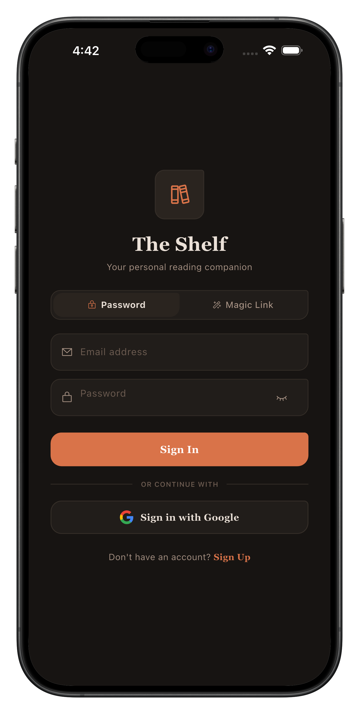
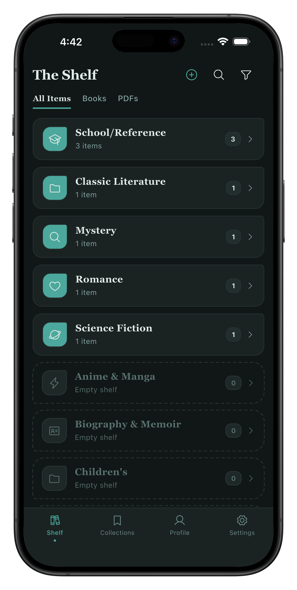
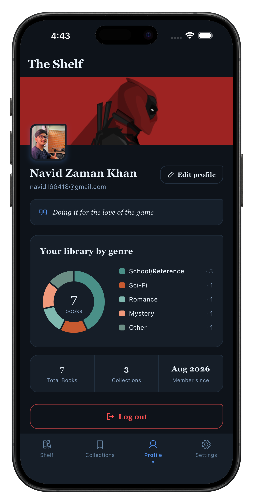
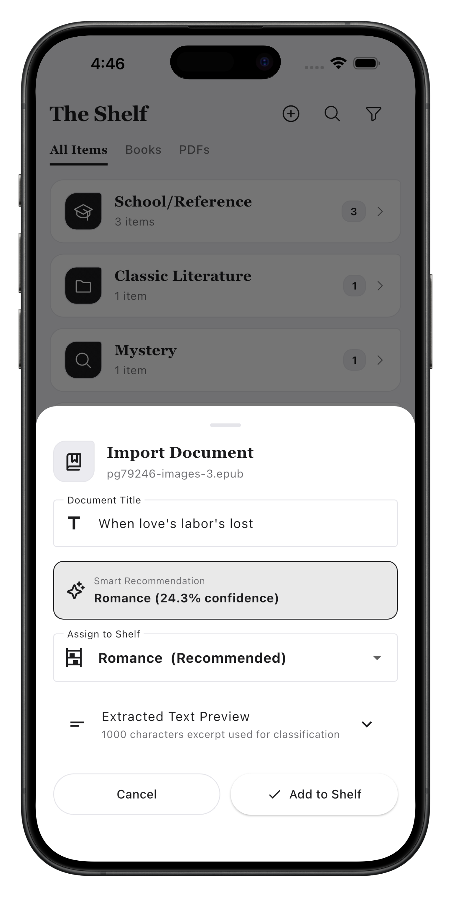
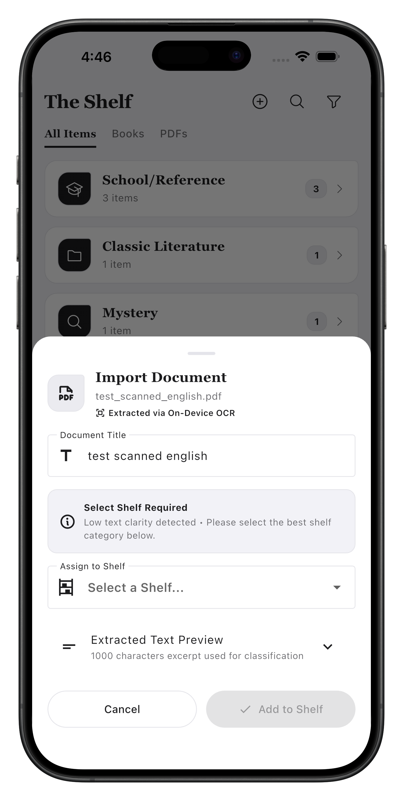
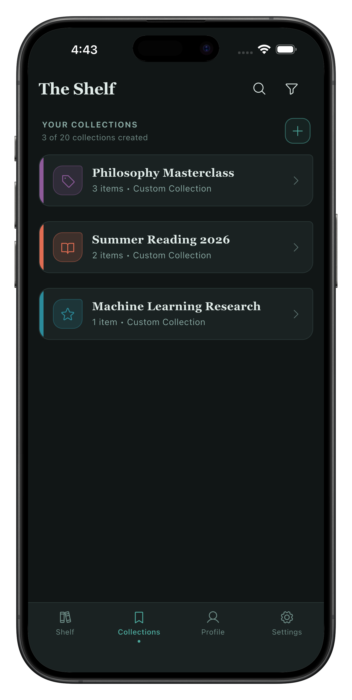
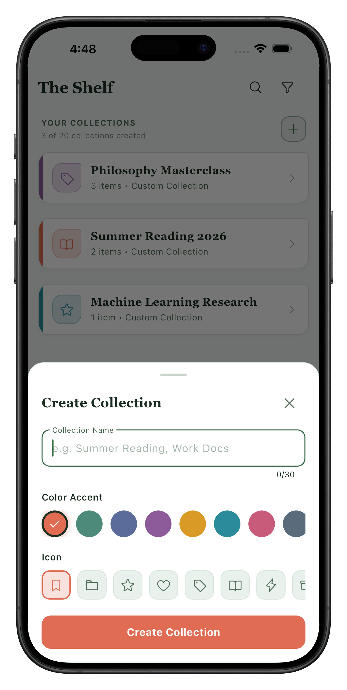
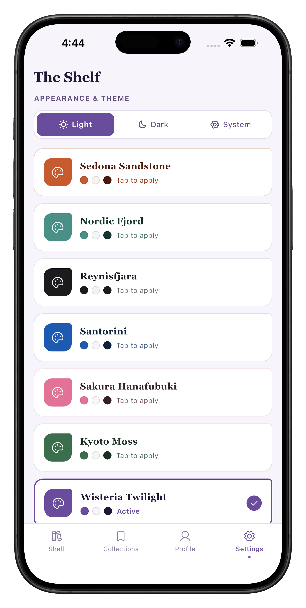
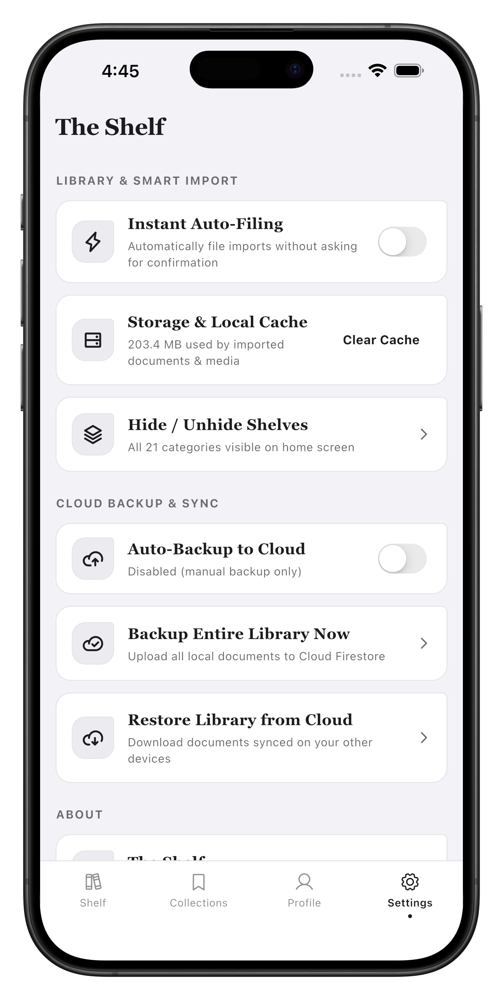

# The Shelf

The Shelf is a privacy-first, on-device digital library and document manager built with Flutter and Dart. It organizes, searches, and reads PDF and EPUB documents across 21 automatically categorized shelves using an ultra-low-latency on-device machine learning classifier, a hybrid on-device OCR engine for scanned files, local SQLite persistence, and optional Cloud Firestore synchronization.

---

## User Interface Showcase

### 1. Onboarding & Core Library

<table>
  <thead>
    <tr>
      <th width="33.33%" align="center">Authentication Flow</th>
      <th width="33.33%" align="center">Home Library Shelves</th>
      <th width="33.33%" align="center">Reader Profile & Analytics</th>
    </tr>
  </thead>
  <tbody>
    <tr>
      <td align="center" valign="top">
        
      </td>
      <td align="center" valign="top">
        
      </td>
      <td align="center" valign="top">
        
      </td>
    </tr>
    <tr>
      <td align="center" valign="top">Email, passwordless Magic Link, and official Google Sign-In with guest mode access.</td>
      <td align="center" valign="top">Populated-first shelf sorting, unread item counters, format segmented filters, and header actions.</td>
      <td align="center" valign="top">Library genre breakdown donut chart, reading motto banner, and account management.</td>
    </tr>
  </tbody>
</table>

---

### 2. Intelligent Document Ingestion & Collections

<table>
  <thead>
    <tr>
      <th width="33.33%" align="center">Smart Categorization</th>
      <th width="33.33%" align="center">On-Device OCR Recognition</th>
      <th width="33.33%" align="center">Custom Collections</th>
    </tr>
  </thead>
  <tbody>
    <tr>
      <td align="center" valign="top">
        
      </td>
      <td align="center" valign="top">
        
      </td>
      <td align="center" valign="top">
        
      </td>
    </tr>
    <tr>
      <td align="center" valign="top">Sub-millisecond machine learning predictions with confidence scores and editable document titles.</td>
      <td align="center" valign="top">Native Apple Vision OCR extraction with fallback safety-net prompt for low-clarity scans.</td>
      <td align="center" valign="top">User-curated document playlists with many-to-many SQLite relationships and item counts.</td>
    </tr>
  </tbody>
</table>

---

### 3. Customization, Theming & Storage

<table>
  <thead>
    <tr>
      <th width="33.33%" align="center">Create Collection Modal</th>
      <th width="33.33%" align="center">Appearance & Themes</th>
      <th width="33.33%" align="center">Storage & Cloud Settings</th>
    </tr>
  </thead>
  <tbody>
    <tr>
      <td align="center" valign="top">
        
      </td>
      <td align="center" valign="top">
        
      </td>
      <td align="center" valign="top">
        
      </td>
    </tr>
    <tr>
      <td align="center" valign="top">Interactive color accent palette selection and Phosphor vector iconography customization.</td>
      <td align="center" valign="top">Nine theme combinations with real-time palette switching across light, dark, and system modes.</td>
      <td align="center" valign="top">Local storage cache management, shelf visibility toggles, and manual cloud backup controls.</td>
    </tr>
  </tbody>
</table>

---

## Key Features

- **On-Device Machine Learning Classification**: High-speed document categorization across 21 shelves powered by a custom pure-Dart inference engine (TF-IDF vectorizer and multinomial logistic regression) executing in under 1 ms with zero external server or cloud API dependencies.
- **Hybrid On-Device OCR Pipeline**: Automatically detects scanned or image-based PDFs and runs optical character recognition on-device. Uses Apple's native Vision framework on iOS/macOS via a custom Swift plugin and Google ML Kit on Android, supported by a 150 DPI rasterizer and low-confidence safety nets.
- **Multi-Format Library Management**: First-class support for PDF and EPUB files with segmented library filtering (All Items, Books, PDFs) and full-text metadata extraction.
- **Custom Collections**: User-created playlists to group documents across genres. Supports custom color palettes, Phosphor vector icons, and SQLite many-to-many join relationships.
- **Nine-Theme Design System**: Three curated color palette families (Monochrome Classic, Warm Sand, and Nordic Forest) paired with three brightness modes (Light, Dark, System) for nine persistent theme combinations.
- **Flexible Sorting and Filtering**: Multi-criteria shelf sorting (Populated First, Alphabetical A-Z / Z-A, Most Items, Least Items, and Recently Modified) saved persistently across sessions.
- **Offline-First SQLite Architecture**: Complete local persistence using SQLite (sqflite) with automated schema migrations (v1 to v2) ensuring zero data loss during updates.
- **Authentication and Cloud Profile Sync**: Optional Firebase Authentication (Email/Password, Magic Link, Google Sign-In, and Guest Mode) with Cloud Firestore profile and banner synchronization.
- **In-App Developer Diagnostics**: Dedicated classifier and OCR testing screen (ClassifierDebugScreen) to inspect tokenization, inference latency, class probabilities, and real-time OCR extraction.

---

## Machine Learning Subsystem

The Shelf does not rely on third-party cloud LLMs or heavyweight binary runtimes such as TensorFlow Lite or ONNX. Instead, it uses a lightweight, custom-built, pure-Dart inference pipeline.

### Architecture

1. **Extraction**: Embedded text is extracted from PDF spines and EPUB metadata. If text content is under 80 non-watermark characters, the OCR pipeline is triggered.
2. **Preprocessing and Tokenization**: Text is normalized, stripped of noise and URLs, and converted into n-grams (unigrams and bigrams).
3. **TF-IDF Vectorization**: Sparse term-frequency inverse-document-frequency dot product matching against a 4.1 MB model vocabulary asset.
4. **Softmax Multi-Class Logistic Regression**: Probability distribution calculated across all target shelves.

### Performance Metrics

- **Model Asset Size**: 4.1 MB (`assets/models/tfidf_model.json`).
- **Warm Inference Latency**: 0.05 ms to 0.5 ms (average ~0.1 ms per document).
- **Cold Start Parse Time**: Under 4 ms.
- **Memory Footprint**: Under 2 MB RAM during active inference.
- **External Dependencies**: Zero native C/C++ or Python dependencies for classification.

---

## On-Device Optical Character Recognition (OCR)

To handle photocopied, scanned, or image-only documents where standard text extraction returns zero characters, The Shelf integrates a native on-device OCR pipeline.

### Pipeline Workflow

1. **Smart Detection Threshold**: The system checks if raw extracted text is fewer than 80 characters after filtering URLs and watermark noise (`needsOcrFallback`).
2. **Page Rasterization**: The first three pages of the document are rendered into memory-safe bitmaps at 150 DPI using `pdf_render`.
3. **Platform Native OCR**:
   - **iOS and macOS**: Processed by Apple's native Vision framework (`VNRecognizeTextRequest`) through a Swift MethodChannel plugin in `AppDelegate.swift`. Uses accurate recognition level and neural language correction with zero third-party CocoaPods.
   - **Android**: Processed through Google ML Kit Text Recognition.
4. **Early Exit and Timeout**: Recognition terminates early once 600 or more valid characters are gathered, with a strict 4-second timeout to maintain UI responsiveness.
5. **Safety-Net Fallback**: If OCR yields under 50 characters (e.g., unsupported scripts such as Bangla), the UI displays a `Select Shelf Required` notice, preventing documents from being silently misfiled into Miscellaneous.

---

## Supported Shelves (21 Categories)

1. Anime & Manga
2. Biography & Memoir
3. Children's
4. Classic Literature
5. Fantasy
6. Graphic Novels & Comics
7. Historical Fiction
8. History
9. Horror
10. Humor
11. Mystery
12. Philosophy
13. Poetry
14. Religion & Spirituality
15. Romance
16. School/Reference
17. Science Fiction
18. Self-Help & Personal Development
19. Thriller
20. Young Adult
21. Miscellaneous (Fallback)

---

## Technical Architecture and Project Structure

```text
lib/
|-- blocs/
|   |-- auth/                     # Authentication state management
|   |-- collection/               # Custom collections and join table BLoC
|   |-- document_import/          # Document picking, OCR, and classification BLoC
|   |-- shelf/                    # Shelf documents state management
|   `-- theme/                    # 9-theme palette and brightness Cubit
|-- models/
|   |-- collection_model.dart     # Collection data model
|   |-- imported_document_summary.dart # Metadata, OCR flags, and predictions
|   |-- mock_shelf_items.dart     # Mock items for testing and fallbacks
|   |-- shelf_state.dart          # Shelf item and document models
|   |-- sort_option.dart          # Sorting criteria definitions
|   `-- user_profile.dart         # User profile and cloud metadata model
|-- screens/
|   |-- auth_screen.dart          # Email, Google, and Magic Link authentication
|   |-- classifier_debug_screen.dart # Interactive ML and OCR diagnostic tools
|   |-- collection_detail_screen.dart # Documents inside a custom collection
|   |-- home_screen.dart          # Main library grid, format tabs, and shelves
|   |-- profile_screen.dart       # User profile, statistics, and motto editor
|   |-- search_screen.dart        # Full-text library search
|   |-- settings_screen.dart      # Appearance, palettes, and database management
|   |-- shelf_detail_screen.dart  # Shelf-specific document list and grid views
|   `-- splash_screen.dart        # Session restoration splash view
|-- services/
|   |-- app_settings_service.dart # SharedPreferences wrapper
|   |-- auth_repository.dart      # Firebase Auth integration
|   |-- cloud_library_service.dart# Cloud Firestore document synchronization
|   |-- collection_repository.dart# SQLite collections repository (v1 to v2)
|   |-- document_import_service.dart # File importer coordinator
|   |-- document_repository.dart  # SQLite persistence repository
|   |-- ocr_service.dart          # Hybrid Vision/ML Kit OCR service
|   |-- shelf_classifier_service.dart # Pure Dart TF-IDF ML classifier
|   `-- user_profile_repository.dart # Firestore profile repository
|-- theme/
|   |-- app_color_palette.dart    # Theme palette tokens (Monochrome, Warm, Forest)
|   `-- app_theme.dart            # Material 3 ThemeData generator
|-- widgets/                      # Reusable UI components
`-- main.dart                     # Application root and provider bindings
```

---

## Database Architecture

### SQLite Local Schema (`the_shelf_documents.db`)

The database utilizes SQLite through `sqflite` with automatic version migration handling:

```sql
CREATE TABLE documents (
  id TEXT PRIMARY KEY,
  title TEXT NOT NULL,
  shelf TEXT NOT NULL,
  file_path TEXT NOT NULL,
  added_at TEXT NOT NULL,
  user_id TEXT DEFAULT 'guest_local'
);

CREATE TABLE collections (
  id TEXT PRIMARY KEY,
  name TEXT NOT NULL,
  color_hex TEXT NOT NULL,
  icon_name TEXT NOT NULL,
  created_at TEXT NOT NULL,
  user_id TEXT DEFAULT 'guest_local'
);

CREATE TABLE collection_documents (
  collection_id TEXT NOT NULL,
  document_id TEXT NOT NULL,
  added_at TEXT NOT NULL,
  PRIMARY KEY (collection_id, document_id),
  FOREIGN KEY (collection_id) REFERENCES collections(id) ON DELETE CASCADE
);

CREATE INDEX idx_documents_shelf ON documents(shelf);
CREATE INDEX idx_documents_title ON documents(title);
CREATE INDEX idx_documents_user ON documents(user_id);
```

### Schema Migration v1 to v2
When upgrading from schema version 1 to version 2, the `onUpgrade` hook creates the `collections` and `collection_documents` tables if they do not exist, ensuring that existing documents remain fully preserved without data loss.

---

## Getting Started

### Prerequisites

- Flutter SDK version 3.12.0 or higher
- Dart SDK version 3.0.0 or higher
- Xcode 15 or higher (for iOS development)
- Android Studio / Android SDK (for Android development)

### Installation and Setup

1. **Clone the repository**:
   ```bash
   git clone https://github.com/NavidZamanKhan/The-Shelf.git
   cd The-Shelf
   ```

2. **Install dependencies**:
   ```bash
   flutter pub get
   ```

3. **Verify code quality**:
   ```bash
   flutter analyze
   ```

4. **Execute test suite**:
   ```bash
   flutter test
   ```

5. **Run the application**:
   ```bash
   flutter run
   ```

---

## Test Coverage

The codebase includes 30 automated test suites verifying all core layers:

- **Classifier Tests** (`test/classifier_service_test.dart`): Verifies TF-IDF tokenization, probability math, and top-3 category ranking for English, Bangla, and technical text.
- **OCR and Safety-Net Tests** (`test/ocr_service_test.dart`): Tests 80-character threshold detection, URL stripping, and the low-confidence manual shelf selection trigger.
- **Database Migration Tests** (`test/collection_repository_test.dart`): Validates schema creation, many-to-many joins, and v1 to v2 migration data integrity.
- **UI and BLoC Widget Tests** (`test/widget_test.dart`): Tests home screen rendering, format tab switching, shelf card sorting, navigation flows, modal interactions, and theme persistence.

---

## License

This project is developed as an open-source mobile application. All rights reserved.
